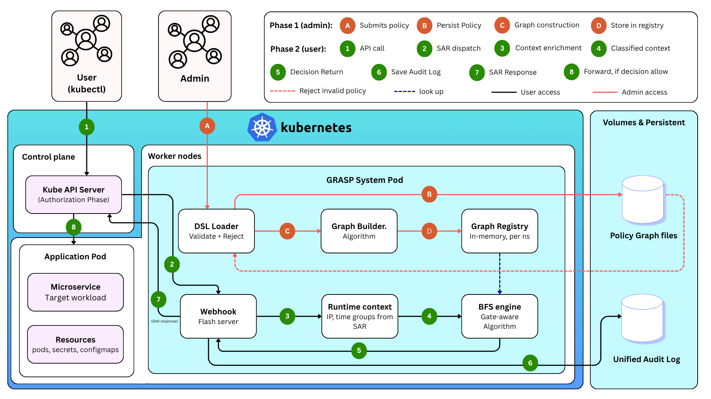
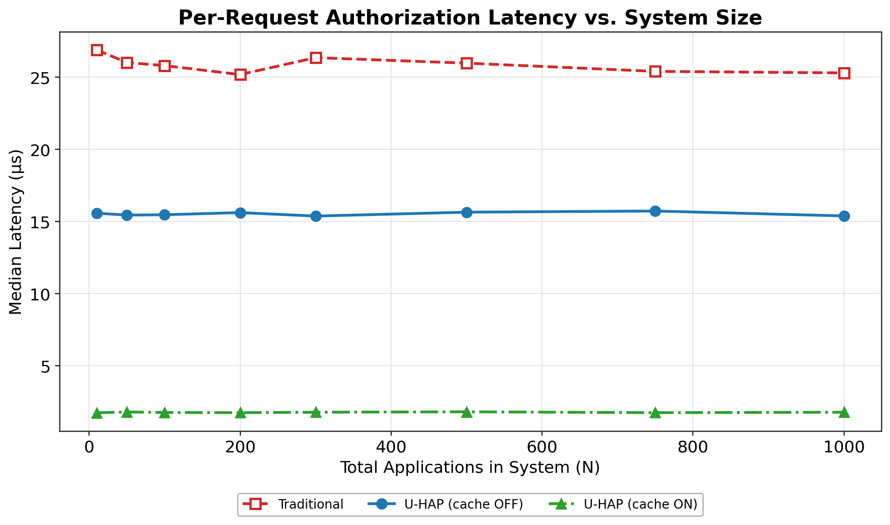
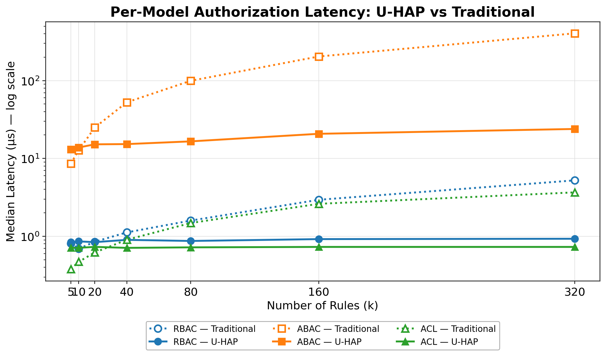
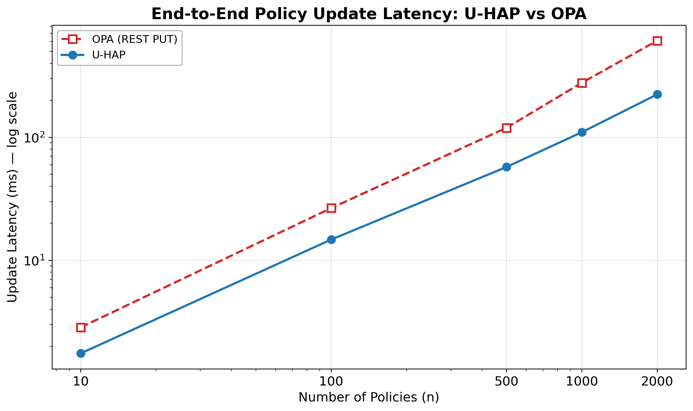

# U-HAP — Unified Authorization over Heterogeneous Policies

U-HAP is a Kubernetes authorization webhook that unifies **ACL**, **RBAC**, **ABAC**, and **deny** policies under one compilation-driven engine. Policies are declared in a single DSL, compiled once into indexed artifacts, and evaluated in near-constant time per request.

## Why

Kubernetes authorization is split across mutually-unaware modules (RBAC, Node, Webhook, ABAC). Expressing policies that span multiple models — e.g. *"ops-team members may delete pods in prod **only** during business hours **unless** the pod is labeled `critical`"* — requires stitching together controllers and admission plugins, with no single place to reason about precedence or conflicts.

U-HAP treats authorization as a compilation problem: the heterogeneous policy set is lowered into a semantic DAG, then compiled into per-`(namespace, resource, action)` indices that a small runtime evaluates with deny-overrides semantics.

## Architecture



Three phases:

| Phase | When | What happens |
|-------|------|--------------|
| **1. Setup** | Deploy | Initialize registry, load trust config |
| **2. Compilation** | Policy change | Parse DSL → validate → build semantic DAG (hash-consed) → compile into indexed artifacts `C_{n,r,a}` |
| **3. Request-time** | Every SubjectAccessReview | O(1) lookup → two-level pruning → index-based evaluation → decision + audit |

The DAG is a **semantic model only** — it is never traversed at runtime. All runtime checks use compiled indices:

- **Deny**: token-pruned candidate set
- **ACL**: hash-set membership (`uid` or `groups ∩ acl`)
- **RBAC**: bit-vector AND over the transitive role closure
- **ABAC**: attribute-key pruning → cost-sorted, memoized predicate evaluation

Evaluation order is fixed: `cache → deny → ACL → RBAC → ABAC → default-deny`.

## Layout

```
src/
├── dsl/         # policy DSL: models, parser, loader
├── compiler/    # Phase 2: graph builder, index compiler, role closure, bit-vectors, registry
├── engine/      # Phase 3: gate nodes, hash consing, pruning, evaluator, cache, context
├── audit/       # decision logging
├── webhook/     # SAR handling
└── main.py      # Flask webhook entrypoint
tests/           # unit tests + scenario suite (S1–S7)
deploy/          # Kubernetes manifests, sample policies
figures/         # paper figures
```

## Quick start

```bash
python -m venv .venv && source .venv/bin/activate
pip install -r requirements.txt

pytest tests/ -v                 # run the test suite
python src/main.py               # start the webhook on :8443
```

### Deploy on a Kind cluster

```bash
kind create cluster --config deploy/kind-config.yaml
kubectl apply -f deploy/webhook-deployment.yaml
kubectl apply -f deploy/webhook-service.yaml
kubectl apply -f deploy/webhook-config.yaml
```

Sample policies live in `deploy/sample-policies/`.

## Correctness scenarios

The test suite enforces seven canonical scenarios covering every policy model and the deny-overrides invariant:

| # | Subject | Model | Target | Context | Expected |
|---|---------|-------|--------|---------|----------|
| S1 | alice | ABAC | `pods/prod get` | on-prem + business hours | ALLOW |
| S2 | alice | ABAC | `pods/prod get` | remote | DENY |
| S3 | alice | RBAC | `pods/dev get` | any | ALLOW |
| S4 | bob | ABAC | `pods/prod delete` | after hours | DENY |
| S5 | * | Deny | `secrets delete` | any | DENY |
| S6 | charlie | ACL | `pods/dev get` | any | ALLOW |
| S7 | dave | Hierarchy | `pods/prod get` | any | ALLOW (via role closure) |

Run them with `pytest tests/test_scenarios.py -v`.

## Results

Three experiments evaluate U-HAP against a conventional SSO-based baseline (Experiments 1–2) and against [OPA](https://www.openpolicyagent.org/) (Experiment 3). See [`paper_experiments/`](paper_experiments/) for full reproduction instructions.

### Experiment 1 — Namespace isolation (latency vs. system size)



U-HAP's per-`(n, r, a)` indexing keeps latency essentially flat (~15 μs) as the number of namespaces scales from 10 to 1,000. The SSO baseline grows linearly. Decision caching adds a further ~14× speedup on warm repeated requests.

### Experiment 2 — Per-model latency vs. rule count



ACL and RBAC checks complete in near-constant time via hash-set lookup and bit-vector AND. ABAC benefits most from compile-time hash consing, reaching 16.9× speedup at k=320 rules; ACL 5.0×, RBAC 5.6×.

### Experiment 3 — Policy update latency vs. OPA



U-HAP completes the full edit-to-first-decision cycle **2.73× faster** than OPA at n=2,000 policies (223 ms vs 611 ms). The post-parse advantage grows to **19.5×** (31 ms vs 611 ms), demonstrating the asymptotic benefit of compile-time hash consing over OPA's per-update Rego compilation. Semantic equivalence of all policies is verified by an automated YAML→Rego translator and decision-equivalence gate (100/100 decisions match at every n).

## Design invariants

1. Deny is checked before any allow path (deny-overrides-all).
2. Role hierarchies are DAGs — cycles are rejected at compile time.
3. Evaluating `(n, r, a)` touches only `C_{n,r,a}`.
4. Structurally identical sub-expressions share one DAG node (hash consing).
5. Each DAG node is evaluated at most once per request (memoization).
6. Bit-vector closures include all transitive role ancestors.
7. Policy change invalidates the decision cache.

## Requirements

Python 3.10+, see `requirements.txt` (Flask, PyYAML, NetworkX, Z3, pytest).

## Author

**Singha Junchan** — Sirindhorn International Institute of Technology (SIIT), Thammasat University.

## License

Apache License 2.0 — see [`LICENSE`](LICENSE).
